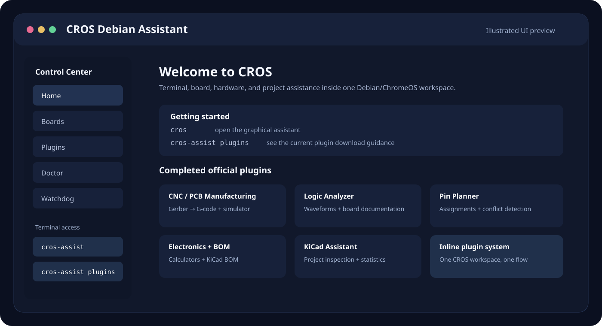

# CROS Debian Assistant

CROS (ChromeOS Debian Assistant) is a desktop and terminal assistant for Debian Linux running in ChromeOS. It provides terminal assistance, project/board tooling, and an inline plugin system.

## Quick start

### Install CROS from GitHub

    sudo apt update
    sudo apt install -y git curl
    git clone https://github.com/chasespringerlr-web/Cros_Debian_Assistant.git
    cd Cros_Debian_Assistant
    bash core/cros_debian_assistant_v24.sh
    source ~/.bashrc
    cros

The short terminal command is:

    cros

The terminal assistant is:

    cros-assist

To update an existing clone:

    cd ~/Cros_Debian_Assistant
    git pull origin main
    bash core/cros_debian_assistant_v24.sh

## Install all official plugins

The current completed plugin set contains five plugins.

From the cloned repository:

    cd ~/Cros_Debian_Assistant
    bash INSTALL_ALL_PLUGINS.sh

Then start/restart CROS:

    cros

Inside CROS, use Plugins -> Reload Plugins.

### Install all five directly from the public repository

You can also install them without cloning the repository:

    curl -fsSL https://raw.githubusercontent.com/chasespringerlr-web/Cros_Debian_Assistant/main/INSTALL_ALL_PLUGINS.sh -o /tmp/cros_install_all.sh
    bash /tmp/cros_install_all.sh

## Install an individual plugin

### CNC / PCB Manufacturing v2.6

    curl -fsSL https://raw.githubusercontent.com/chasespringerlr-web/Cros_Debian_Assistant/main/plugins/cnc/cros_plugin_cnc_manufacturing_v2_6.sh -o /tmp/cros_cnc.sh
    bash /tmp/cros_cnc.sh

### Logic Analyzer + Board Datasheet v1

    curl -fsSL https://raw.githubusercontent.com/chasespringerlr-web/Cros_Debian_Assistant/main/plugins/logic/cros_plugin_logic_analyzer_datasheet_v1.sh -o /tmp/cros_logic.sh
    bash /tmp/cros_logic.sh

### Pin Planner v1

    curl -fsSL https://raw.githubusercontent.com/chasespringerlr-web/Cros_Debian_Assistant/main/plugins/pin/cros_plugin_pin_planner_v1.sh -o /tmp/cros_pin.sh
    bash /tmp/cros_pin.sh

### Electronics Calculator + KiCad BOM v1.2

    curl -fsSL https://raw.githubusercontent.com/chasespringerlr-web/Cros_Debian_Assistant/main/plugins/electronics/cros_plugin_electronics_calculator_bom_v1_2.sh -o /tmp/cros_electronics.sh
    bash /tmp/cros_electronics.sh

### KiCad Assistant v1

    curl -fsSL https://raw.githubusercontent.com/chasespringerlr-web/Cros_Debian_Assistant/main/plugins/kicad/cros_plugin_kicad_assistant_v1.sh -o /tmp/cros_kicad.sh
    bash /tmp/cros_kicad.sh

## Preview

This is an illustrated preview of the CROS workspace. The project is designed around a single main CROS window with inline plugin panels and terminal access.

## License

CROS Debian Assistant is released under the MIT License. See [LICENSE](LICENSE).

## Contributing

See [CONTRIBUTING.md](CONTRIBUTING.md) for development and testing guidance.

## Official plugins

| Plugin | Version | Purpose |
|---|---:|---|
| CNC / PCB Manufacturing | 2.6 | Gerber -> G-code, isolation calculator, tool library, G-code simulator |
| Logic Analyzer + Board Datasheet | 1.0 | CSV capture waveform display and board documentation lookup |
| Pin Planner | 1.0 | Pin assignment, conflict detection, and header export |
| Electronics Calculator + KiCad BOM | 1.2 | Electronics calculations and KiCad BOM workflow |
| KiCad Assistant | 1.0 | KiCad project inspection and project-file statistics |

Only these five plugins are part of the current completed release. Other plugin ideas are not included until they have been implemented and tested.

## Test fixtures

The completed plugins can be tested with the project fixtures maintained with the CROS release process:

- SVG -> G-code test
- Gerber -> G-code test
- Logic Analyzer CSV capture
- KiCad test project

## Updating

CROS source and plugins are hosted in this public repository. To update a Git clone:

    cd ~/Cros_Debian_Assistant
    git pull origin main

Then reinstall/reload the component you changed.

## Terminal plugin help

Once CROS is installed:

    cros-assist plugins

This command explains the current plugin set and plugin installation guidance.

## Security

CROS plugins are local programs. Plugin Python code runs with the permissions of the user who launches CROS. Review third-party or custom plugins before installing them.

## Status

CROS is an actively developed personal project. Plugin and core versions can change as testing continues.

## Repository

https://github.com/chasespringerlr-web/Cros_Debian_Assistant
